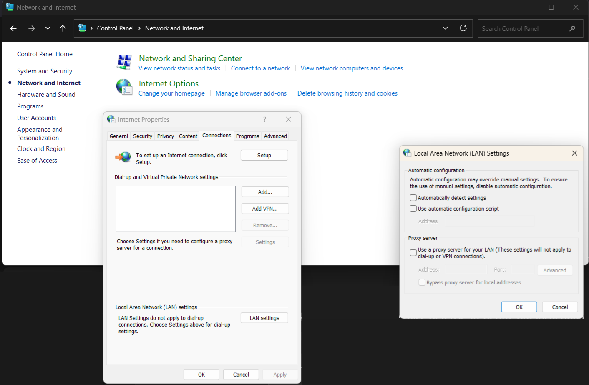

# Description
This file serves as documentation of my use of Wireshark to analyze and understand my DNS traffic and Pi-hole in action.

### Web Proxy Auto-Discovery (WPAD)
Upon opening my Wireshark and capturing from Wi-Fi, I was faced with a bunch of existing queries, leaving me clueless on where to start. So, I restarted the capturing and noticed that I had a repeating set of DNS queries for `wpad.lan`. 

So what is `wpad.lan`, and why is it being queried so often? Surely it's something important, perhaps related to security or updates? 

Nope, WPAD stands for [Web Proxy Auto-Discovery](https://en.wikipedia.org/wiki/Web_Proxy_Auto-Discovery_Protocol), a protocol "used to ensure all systems in an organization use the same web proxy configuration. Instead of individually modifying configurations on each device connected to a network, WPAD locates a proxy configuration file and applies the configuration automatically" (Source: [CISA.gov](https://www.cisa.gov/news-events/alerts/2016/05/23/wpad-name-collision-vulnerability)). 

Supposedly, WPAD first tries to obtain the file via DHCP, then DNS (which is how we discovered this on Wireshark), and finally Link-Local Multicast Name Resolution (LLMNR) and/or NetBIOS. 

So, I filtered for DHCP packets to verify this and found that in fact, within the `Option (55) Parameter Request List` included in the DHCP packets, is list item `(252) Private/Proxy autodiscovery` which is saying to the DHCP server: "If you support option 252 (WPAD URL), please send it to me". 

I asked ChatGPT how to test if I have LLMNR enabled, and it told me to ping a nonexistent hostname while capturing on Wireshark with an `llmnr` filter. If I see LLMNR packets, then I have it enabled. Evidently, I have LLMNR enabled. Wireshark capture resulting from ping command: `ping lanwqdwd1n`:

As for NetBIOS, I found a [blog post](https://blog.alexmags.com/posts/disable-netbios) that showed how to check if it is enabled.

Having WPAD, LLMNR, and NetBIOS on is not safe if you use your machine in a public network. I'm not going to get deep into it because this is not a rabbit hole I want to go down right now. But simply put, these protocols have known exploitable vulnerabilities that may lead to Man-in-the-middle (MITM) attacks (Source: [SentinelOne](https://www.sentinelone.com/blog/in-the-wild-wpad-attack-how-threat-actors-abused-flawed-protocol-for-years/)). The general flow goes like this: client/victim requests information from the network, In a secure home/private network which contains only known and trusted machines, having these protocols enabled is likely ok. However, if you use a laptop and travel with it to airports or cafes where you us public Wi-Fi, it is advised to turn these protocols off. I am at home most of the time but just for good practice and in the event I do travel and access a public network with my laptop in the future, I am going to turn these protocols off. 

Disabling WPAD:

Disabling LLMNR:

Disabling NetBIOS:

4) End off by fixing formatting and making sure all iamges are properly added and included in here.
